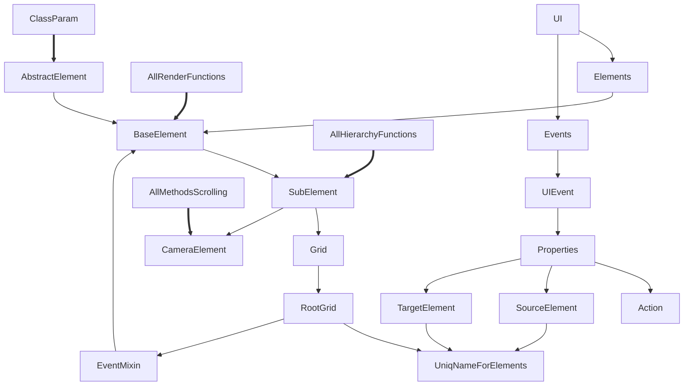

# UIGameGrid
UI tiling for games


## Grid
Grid is root for all components
Grid setup sizes of cells
Components can use cells as coordinates
It make to create components siply for diffrents sizes and orintations screens

Minimal side of grid is base side.
The base sice is always minimal side.

Base side can be 20 cells or 30 cells of lenght.

if grid is resized then cells changes size and gris can chandge base side on other side

### Create Grid
```js
const grid = new Grid() // Default 20 cells on base side
const grid = new Grid(30) // 30 cells on base side
```

### Create Component by Grid
```js
const rootComponent = grid.createComponent("Name_your_Component")
```

### Get Component by Name
```js
const box = grid.get("Name_your_Component")
```


## Component
All components is derived from SubComponent class (exclude base Component class)
The base component class for root component and all render methods
All components calls render methods from Component class
If we want change render engine then we need rewrite only Component class

### Types Components
+ SubComponent - base class for custom components without Grid
+ CellComponent - base class for little components
+ GridComponent - base class for big custom components with Grid

## Architecture Diagram
